#HEXRPG

##**Map & Exploration**
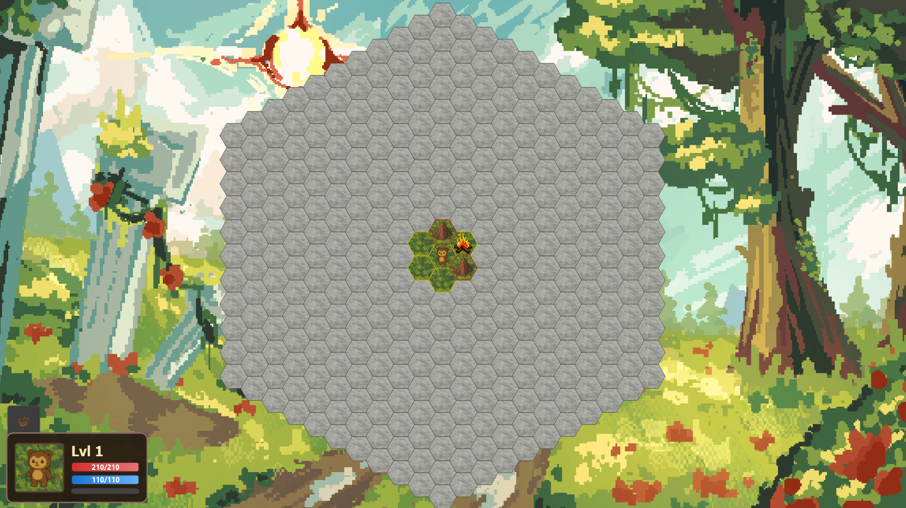
Upon starting the game, you are greeted by a hexagonal map with the main character located in the center.
####**Visibility**: The six immediate hexes around the hero are visible, while the rest are covered by the fog of war.
####**Exploration**: Hexes that have been explored but are currently outside the hero's visibility range become visually darker to indicate their status.

##**Movement**
####**Basic Movement**
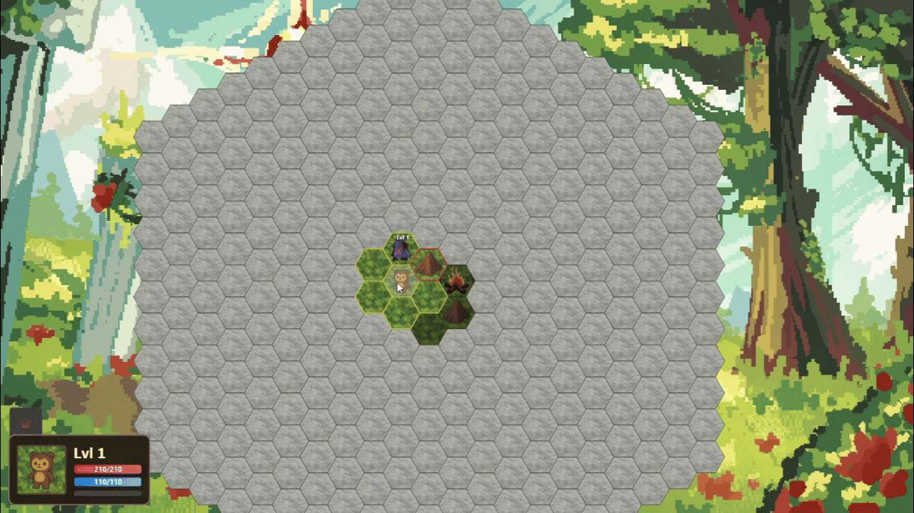
You can move by left-clicking on neighboring hexes, which are highlighted with a gold border.
####**Long-Distance Travel**
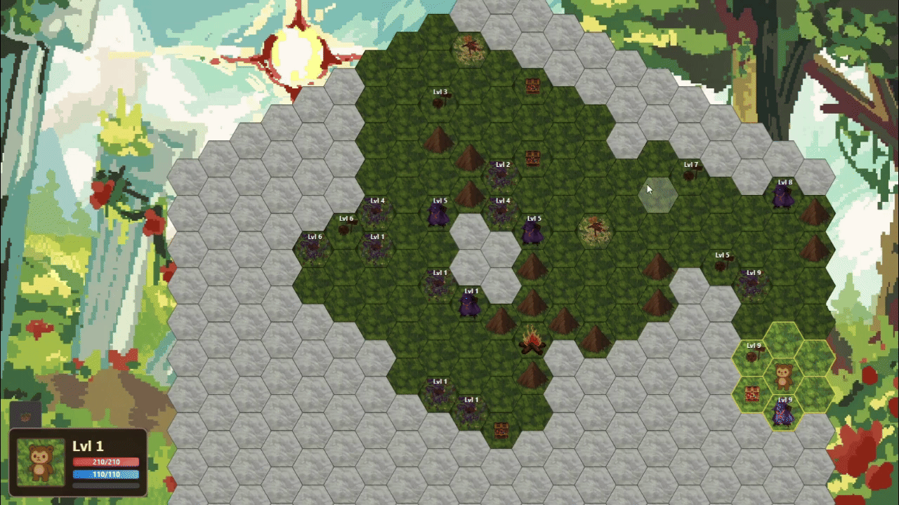
If you have already visited a specific area but it is far away, you can double-click on a hex. The hero will take the shortest route, bypassing all obstacles automatically.

##**Units & Environment**
The world is populated by various units, obstacles, and interactable objects.
####**Interactive Objects**
* **Mountain**: Obstacles that prevent movement. They are highlighted with a red outline, and the hero cannot interact with them.
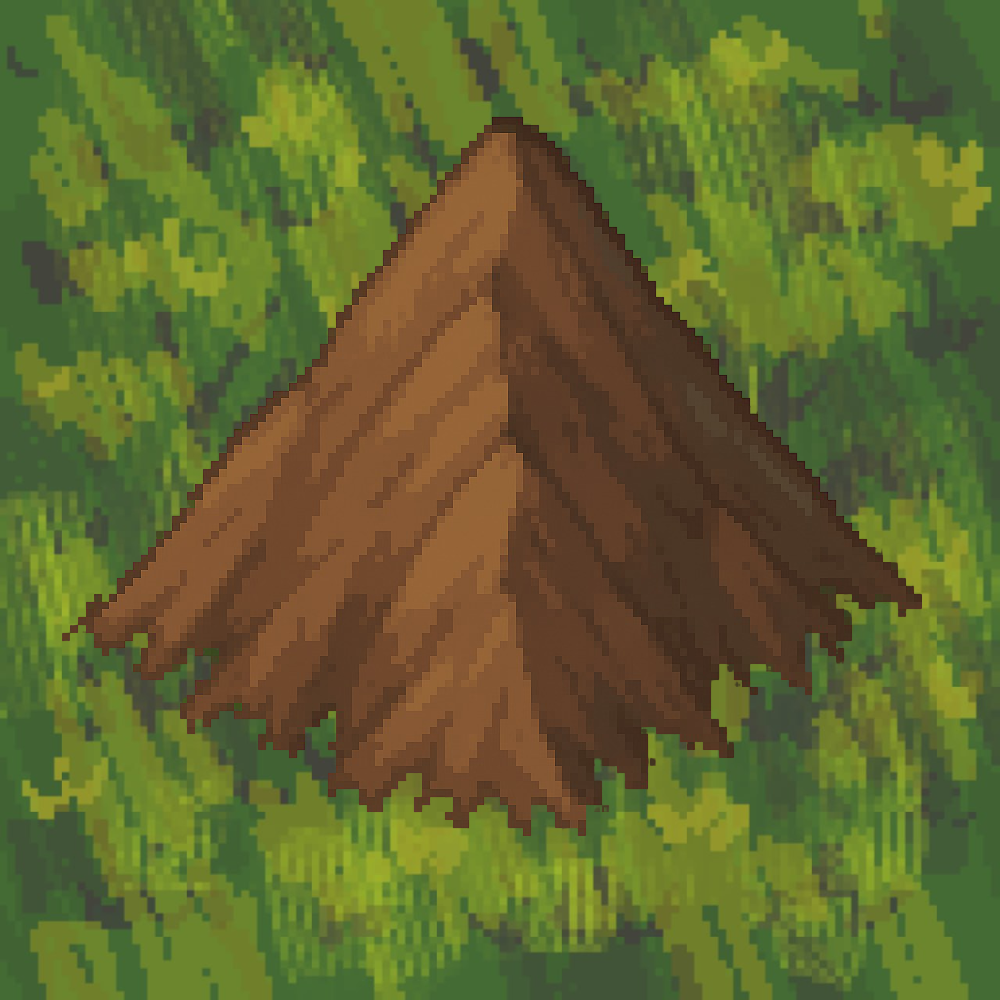
* **Treasure**: A special unit that grants the player 1 full level. The treasure disappears after the interaction.
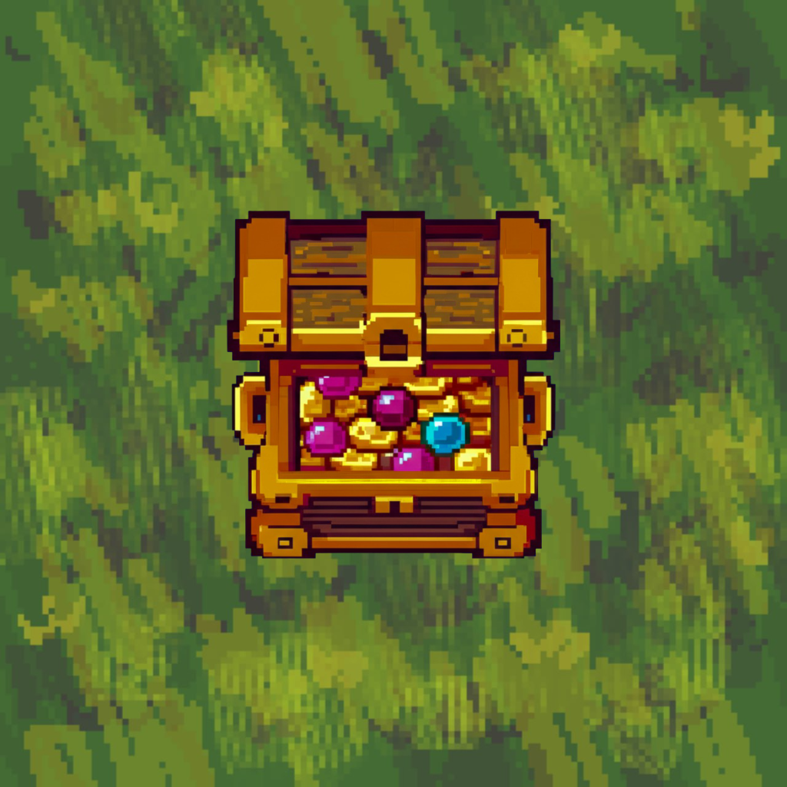
* **Campfire**: The hero's best friend. It heals injuries and restores mana. Use it wisely after tough battles, as the fire will eventually go out and cannot be used forever.
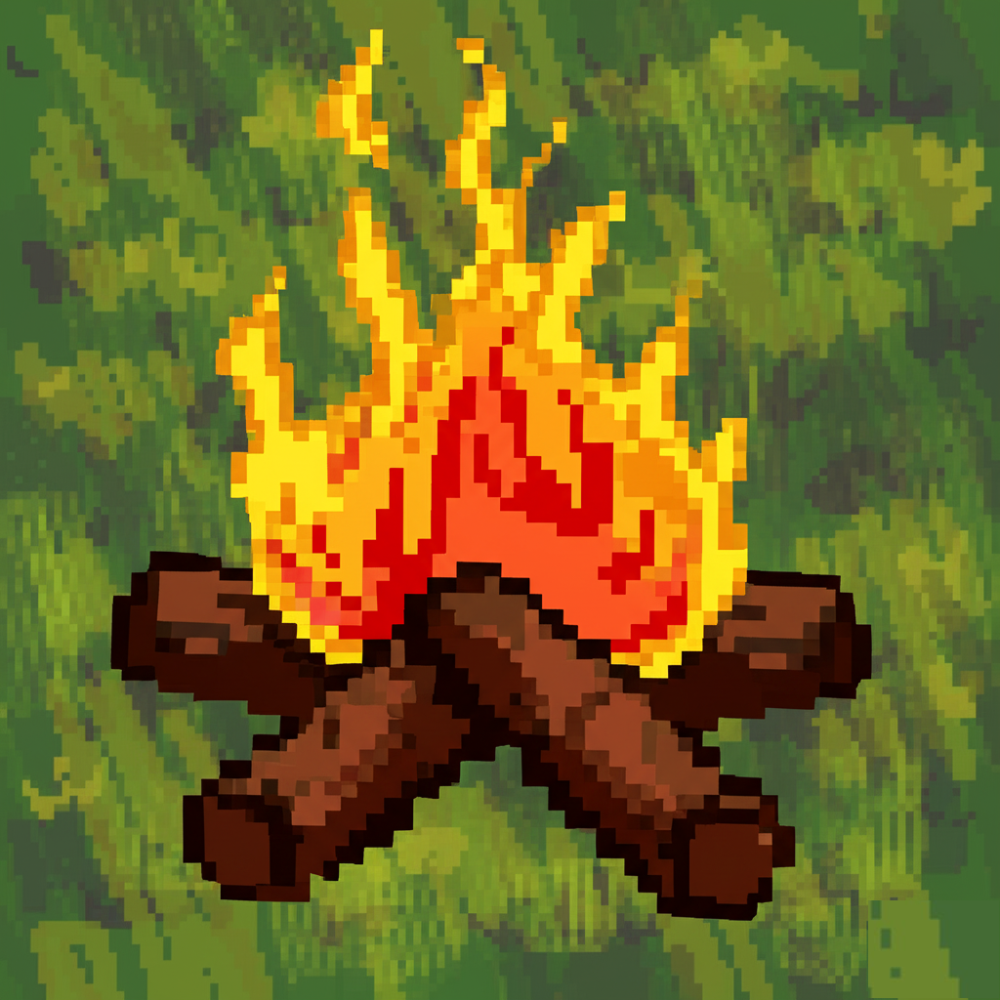
* **Friendly NPC**: Non-hostile units that pose no threat. You can interact with them freely.
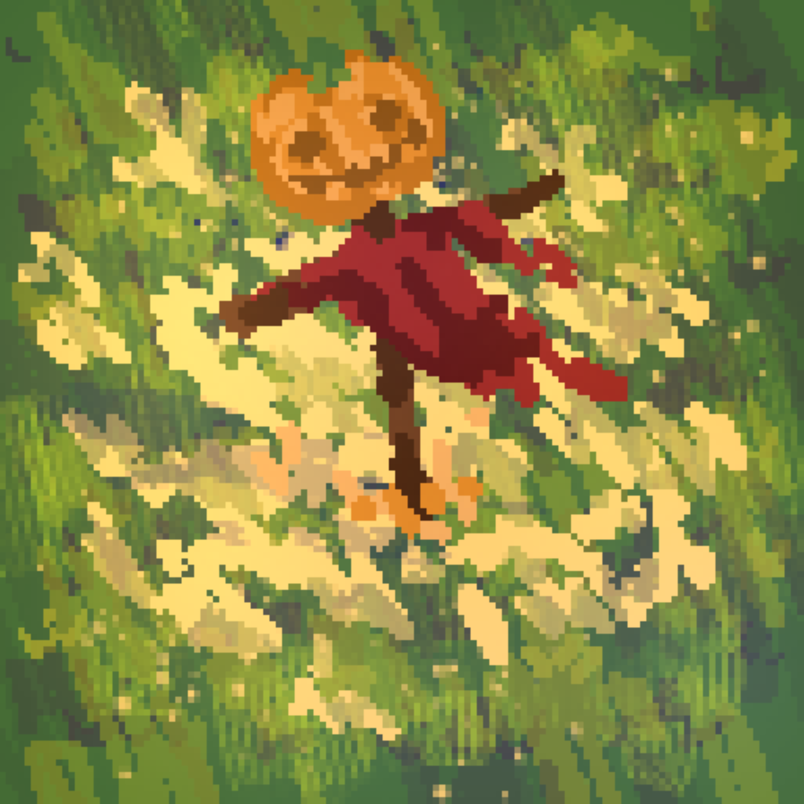
####**Enemies**
* **Barbarian**: A very aggressive enemy that deals high damage but suffers from a small mana pool (runs out quickly).
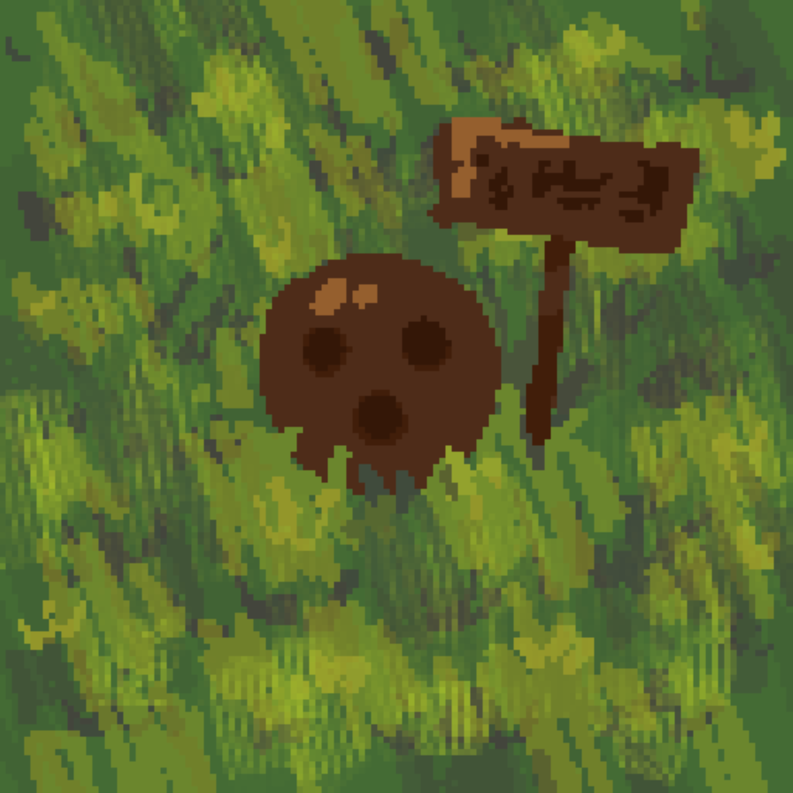
* **Warrior**: An unpredictable opponent. He may cast a deadly spell one turn and the weakest spell the next—it seems he is confused about how to use his magic.
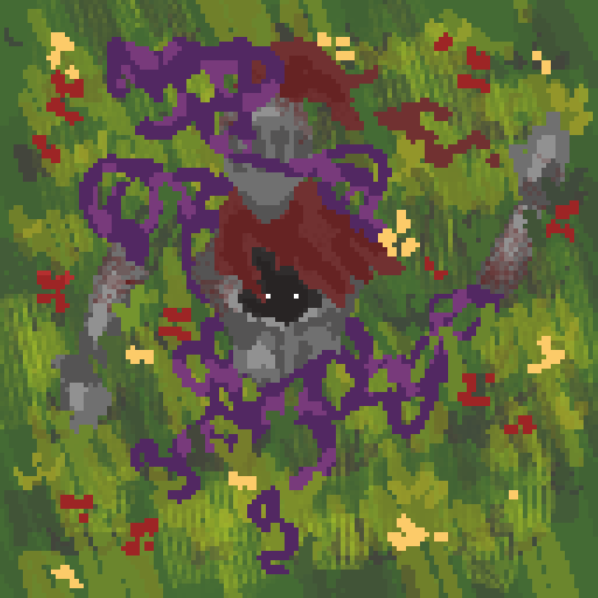
* **Wizard**: An extremely intelligent foe. He casts spells excellently and acts cautiously. However, if he calculates that he can win quickly, he will use his full power immediately.
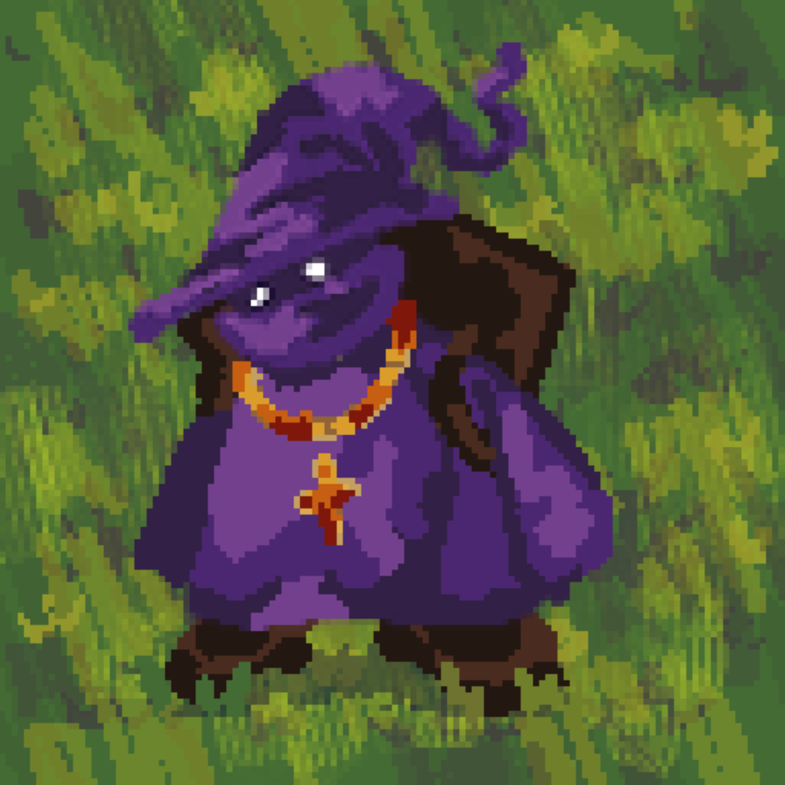

##**Combat System**
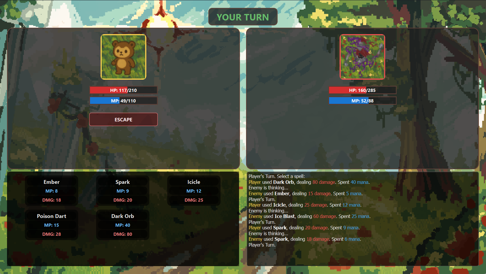
Battle is an essential part of the game, presented as a turn-based exchange of spells. Success depends on strategy; whoever calculates the different spell types and levels better will win the fight.

##**Leveling & Skills**
####**Level System**
* **Experience**: Levels are gained by earning experience from defeating enemies or finding chests.
* **Upgrades**: Upon leveling up, you receive Skill Points and can choose 1 of 3 random stat improvements: HP, Mana or Spell`s damage.
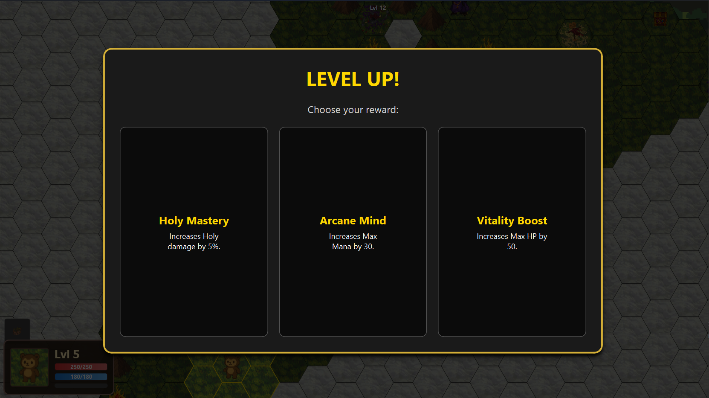
####**Skill Tree**
Players use Skill Points to purchase upgrades from the skill tree. Each branch is associated with a specific spell type and provides: Increased damage, Reduced mana consumption and Unlocking new spells.
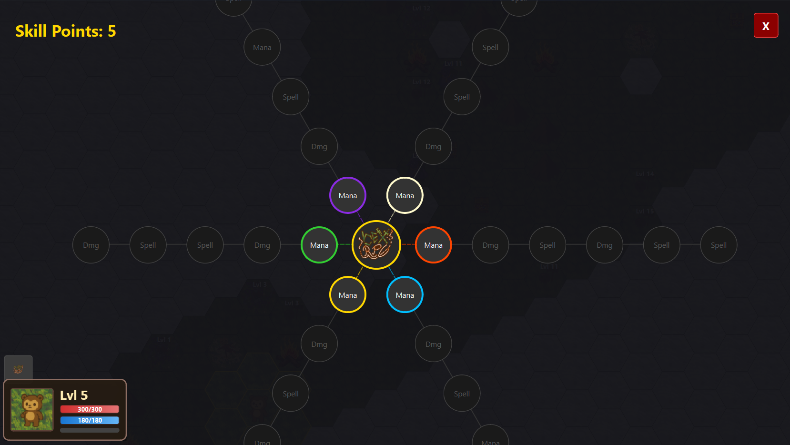
